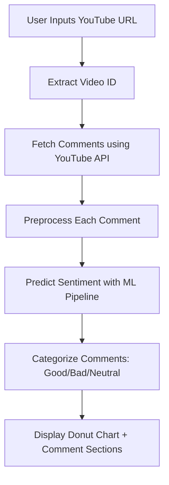

# 🎥 YouTube Comment Sentiment Analyzer

  
  
  


[](https://youtube-comment-sentiment-analyzer-25.streamlit.app/)

> 💬 A Streamlit-powered app that fetches and classifies YouTube comments into **Good**, **Bad**, or **Neutral** using a trained ML pipeline built on TF-IDF and LinearSVC.

---

## 🚀 Features

- 🔗 **YouTube Integration** via Google API to fetch comments
- 🧼 **Preprocessing Pipeline** with regex and normalization
- 📊 **Interactive Visuals** using Plotly donut charts
- 🧠 **Text Classification** using TF-IDF + SVM (LinearSVC)
- 🌐 **Streamlit UI** for easy interaction and visualization

---

## 📌 Technologies Used

| Component         | Tool/Library              |
|------------------|---------------------------|
| Frontend         | Streamlit                 |
| Data Processing  | pandas, re                |
| Visualization    | Plotly                    |
| ML Pipeline      | scikit-learn (TF-IDF + SVM) |
| YouTube API      | `google-api-python-client` |

---

## ⚙️ Installation

```bash
git clone https://github.com/akasha456/YouTube-Comment-Sentiment-Analyzer
cd YouTube-Comment-Sentiment-Analyzer
pip install -r requirements.txt
```

> 🗂️ Place your `YoutubeCommentsDataSet.csv` in the root directory.  
> 🔑 Replace the `API_KEY` in `main.py` with your [YouTube Data API key](https://console.developers.google.com).

---

## 🧠 How It Works



---

## 📊 Example Output Snapshot

| Sentiment | Count |
|-----------|-------|
| 👍 Good   | 52    |
| 👎 Bad    | 27    |
| 😐 Neutral | 21    |

---

## 🌐 Future Enhancements

- 🗃️ Save comment history and results to CSV
- 🧠 Upgrade to deep learning-based sentiment models
- 📱 Deploy as mobile-friendly PWA
- 🌍 Multilingual comment support (translation + sentiment)

---

## 📜 License

This project is licensed under the MIT License.

---

## 💬 Acknowledgements

- [YouTube Data API](https://developers.google.com/youtube/v3)
- [scikit-learn](https://scikit-learn.org)
- [Streamlit](https://streamlit.io)
- [Plotly](https://plotly.com)

---

## 🖼️ Screenshots

[](https://postimg.cc/SX9zCbqh)

